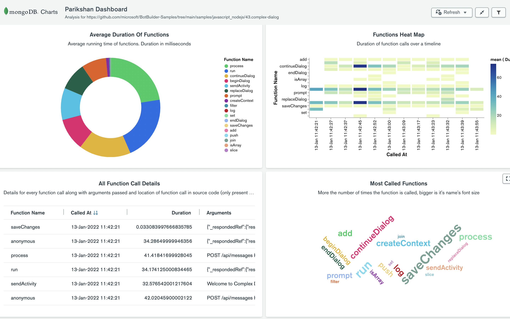

<div align="center">

# ⏰ Parikshan


 
 
 
[](https://www.npmjs.com/package/parikshan)


Compiler to measure the running time of javascript functions.

[Installation](#installation) •
[Usage](#usage) •
[Using with MongoDB](#using-with-mongodb) •
[FAQs](#faqs)


Converts

<div align="left">

```javascript
// index.js
greet('John')
```
</div>

To
<div align="left">

```javascript
// output/index.js
const {parikshan} = require("parikshan/build/src/parikshan");

parikshan(greet)('John');

// if compiled with -s flag then compiles to
parikshan(
  greet,
  {"start":{"line":1,"column":0},"end":{"line":1,"column":13},"filename":"index.js"}
)('John')
```

</div>

</div>

## Installation

To install this package run:
```
npm i parikshan -D
```
or with yarn run:
```
yarn add parikshan -D
```

## Usage

### CLI Usage

```
npx parikshan@latest -h
```

```
parikshan  <files..>

Compiles code to performance.measure the functions

Positional Arguments:
  files  One or more files or glob patterns to compile

Options:
  -h, --help        Show help                                          [boolean]
  -v, --version     Show version number                                [boolean]
  -o, --output-dir  Output directory       [string] [default: "build/parikshan"]
  -s, --source-loc  Capture line, column number in performance measurement
                                                      [boolean] [default: false]

Examples:
  parikshan "{,!(node_modules)/**/}*.js"    Compile all js files except for
  -o output                                 files under node_modules to output
                                            folder
  parikshan build/src/**/*.js -so output    Compile to output folder with source
                                            location captured
```

### API Usage

```javascript
import {Compiler} from "parikshan"

const compiler = new Compiler()
const compiledFileContents = await compiler.compile(["build/src/**/*.js"], "output", true)
```

**See [docs/README.md](docs/README.md)**.

### Subscribing to PerformanceEntry Events

```javascript
const observer = new PerformanceObserver(entryList => {
  const entries = entryList.getEntries();
  const parikshans = entries.filter(entry => entry.name === 'parikshan')
  // do anything with performance entries generated by parikshan
});

observer.observe({
  entryTypes: ['measure'],
});
```

### Performance Entry Structure

```typescript
{
  /** PerformanceEntry name */
  name: 'parikshan';
  /** A high res timeStamp representing the time value of the duration of the function */
  duration: number;
  /** A high res timeStamp representing the starting time for the performance metric. Not a UNIX timestamp */
  startTime: number;
  /** Entry type */
  entryType: 'measure';
  /** Extra details */
  detail: {
    /** Function name. 'anonymous' if function doesn't have any name */
    functionName: string;
    /** list of function's stringified arguments */
    arguments: string[];
    /** `Date` object for function called at */
    calledAt: Date;
    /** `Date` object for function returned at */
    returnedAt: Date;
    /** Location of function in source code. Will be only present when compiled with -s flag else undefined */
    location:
      | {
          start: {
            line: number;
            column: number;
          };
          end: {
            line: number;
            column: number;
          };
          filename: string;
        }
      | undefined;
  };
}
```

## Using with MongoDB

Use package's [initMongoPerfSubscriber](docs/README.md#initmongoperfsubscriber) function to store performance entries in MongoDB.

> If given collection doesn't exist, it will create [time series collection](https://docs.mongodb.com/manual/core/timeseries-collections/) with given name. In case time series collection
is not supported (i.e. MongoDB version below 5.0) then normal collection will be created.

[Check document structure](docs/interfaces/ParikshanMongoDocument.md).

You can create MongoDB charts dashboard by importing [Parikshan.charts](assets/Parikshan.charts) file and connect it to collection. [Check blog post on how to import/export dashboard](https://www.mongodb.com/blog/post/import-export-your-charts-dashboards).

[](https://charts.mongodb.com/charts-hackathon-xezpo/public/dashboards/61ddb47a-69ec-49df-8061-145da7025f8b)

Usage of [initMongoPerfSubscriber](docs/README.md#initmongoperfsubscriber)
```javascript
// at the start of entry/main file do
const {initMongoPerfSubscriber} = require('parikshan')
initMongoPerfSubscriber({
   dbConnectionString: process.env.DB_CONN_STRING,
   dbName: process.env.DB_NAME,
   collectionName: process.env.DB_COLLECTION,
   // optional
   deleteAfterSeconds: 60 * 60
})
```

## FAQs

**Q: Can it compile typescript ?**
<br>
Not directly. But you can run typescript compiler first and then compile output js files.
For example `tsc && parikshan build/src/**/*.js -so output`

**Q: Can this be used with frontend code ?**
<br>
Yes, before bundling you can compile it. Creating a webpack loader is in roadmap. 

**Q: When should this _not_ be used ?**
<br>
1. When you are overwriting defintion for `Promise.prototype.finally` in your code. It may give max call stack exceeded error due to recursive calls
2. Not recommended in production environment.

**Q: Why not wrap in `performance.timerify` instead of `parikshan` ?**
<br>
1. To add additional details to performance entries.
2. `performance.timerify` only works in NodeJS environment as it uses internal native binding.

**Q: How was the example project shown in [dashboard](#using-with-mongodb) compiled ?**
<br>

> NOTE :- having Azure account is not required for this to run. So envs in `.env` of `43.complex-dialog` can be left undefined.

```bash
# clone botbuilder samples repo
git clone https://github.com/microsoft/BotBuilder-Samples.git

# goto 43.complex-dialog example
cd BotBuilder-Samples/samples/javascript_nodejs/43.complex-dialog

# install dependencies
npm install

# install parikshan as dev dependency
npm i parikshan -D

# at the beginning of index.js, add
#
# const {initMongoPerfSubscriber} = require('parikshan')
# initMongoPerfSubscriber({
#   dbConnectionString: process.env.DB_CONN_STRING,
#   dbName: process.env.DB_NAME,
#   collectionName: process.env.DB_COLLECTION,
# })

# compile with parikshan
npx parikshan "{,!(node_modules)/**/}*.js" -s

# run compiled code
node build/parikshan/index.js

# converse with bot using botframework emulator. Check README of 43.complex-dialog for info on this.

# performance entries will be stored in collection as users are using bot.
# create your own MongoDB charts dashboard or import dashboard of this project to get insights of your code.

# Adjust refresh time in `Auto-refresh settings` of dashboard according to your need
```

**Q: What does word "parikshan" means ?**
<br>
Word "parikshan" is originated from Sanskrit language meaning "examine"


